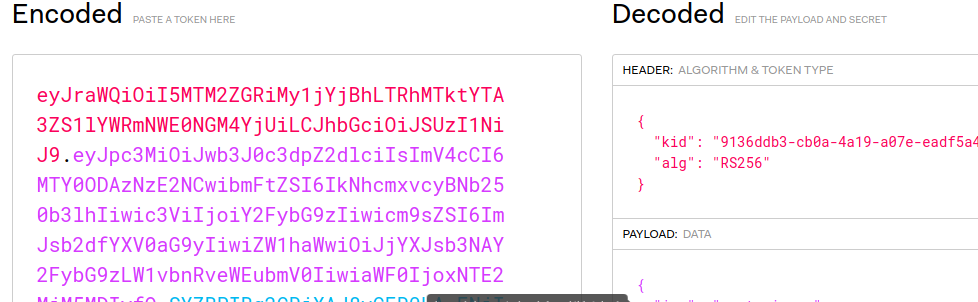
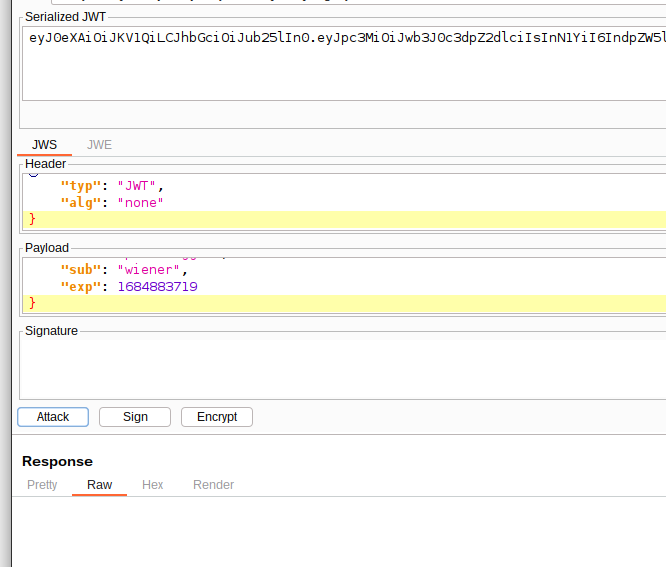
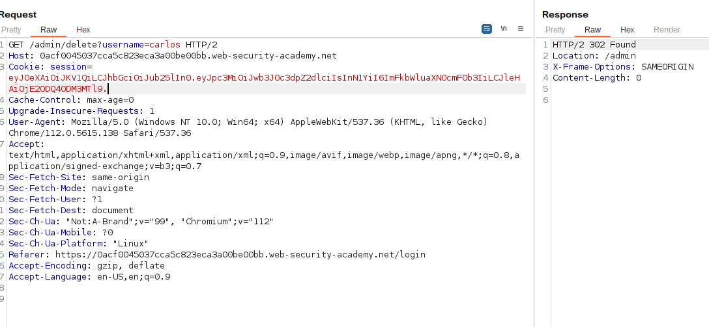

* Among other things, the JWT header contains an `alg` parameter. This tells the server which algorithm was used to sign the token and, therefore, which algorithm it needs to use when verifying the signature;

* JWTs can be signed using a range of different algorithms;
* But can also be left **unsigned**. In this case, the `alg` parameter is set to `none`, which indicates a so-called "unsecured JWT";
* Even if the token is unsigned, the payload part must still be terminated with a **trailing dot** ==

---

* This lab uses a JWT-based mechanism for handling sessions. The server is insecurely configured to accept unsigned JWTs.

* To solve the lab, modify your session token to gain access to the admin panel at `/admin`, then delete the user `carlos`.

* Solving the lab 

