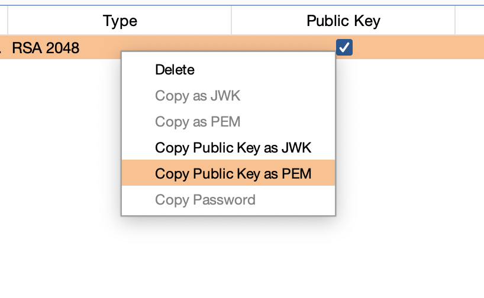
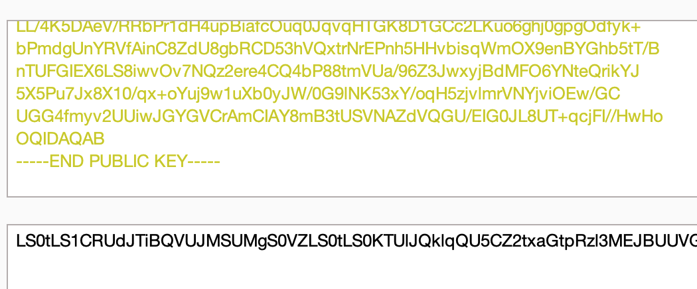
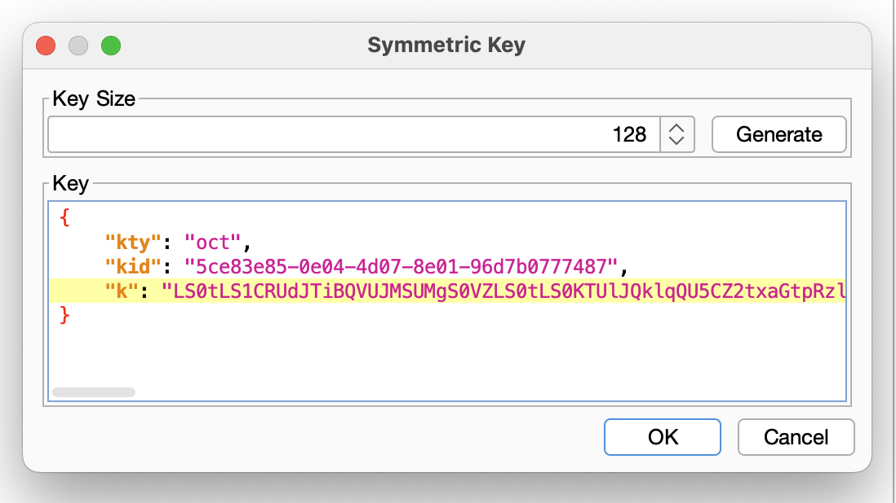

### Lab description

This lab uses a JWT-based mechanism for handling sessions. It uses a robust RSA key pair to sign and verify tokens. However, due to implementation flaws, this mechanism is vulnerable to algorithm confusion attacks.

To solve the lab, first obtain the server's public key. This is exposed via a standard endpoint. Use this key to sign a modified session token that gives you access to the admin panel at `/admin`, then delete the user `carlos`.

You can log in to your own account using the following credentials: `wiener:peter`

### Solution 

*  Labs hint
 > You can assume that the server stores its public key as an X.509 PEM file.

* Verify the `jwks.json` endpoint. The server expose the JWK set containing a `public key` look at the `n`  parameter.

* Copy the response of this request.
* Steps to generate a malicious `key` 
	* Generate new `RSA` key ( choose JWK )

* Paste the content of the response copied from `jwks.json`

* Copy public key as `PEM`

* Go to decoder tab from burpsuite and paste the content copied. Encode as `base64`

* Go to JWT Editor extension and create a new `Symetric key` and at the `k` value, change the `k` with the `PEM` base64 string generated.

* Go to burp repeater and at the `JSON Web Token Tab` change the value of the `alg` token to `HS2256` and the `sub` administrator.

* At the botton click and `sign` then select the symetric key created. And sent the request to `\admin`

* Lab solved 
  
  

