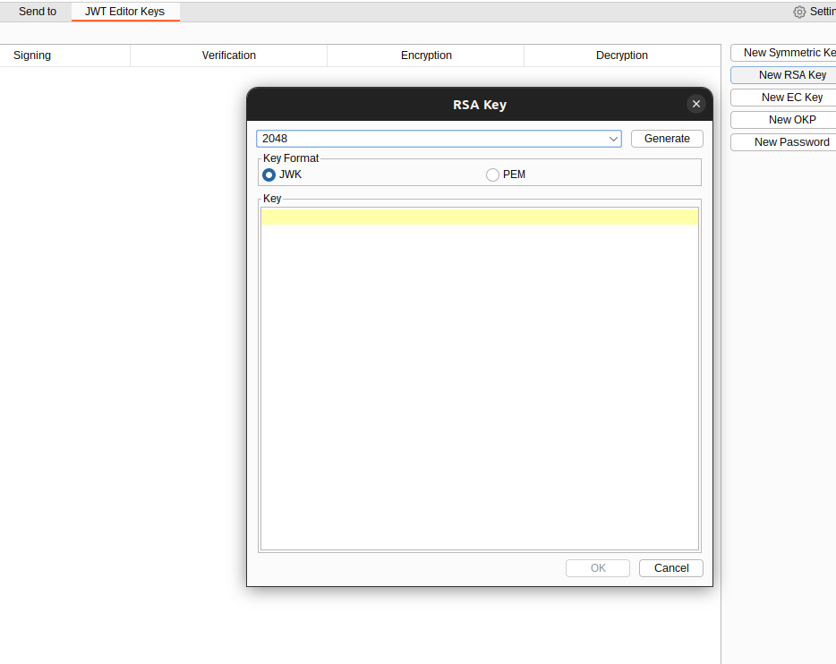
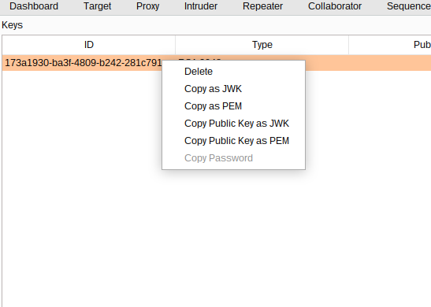
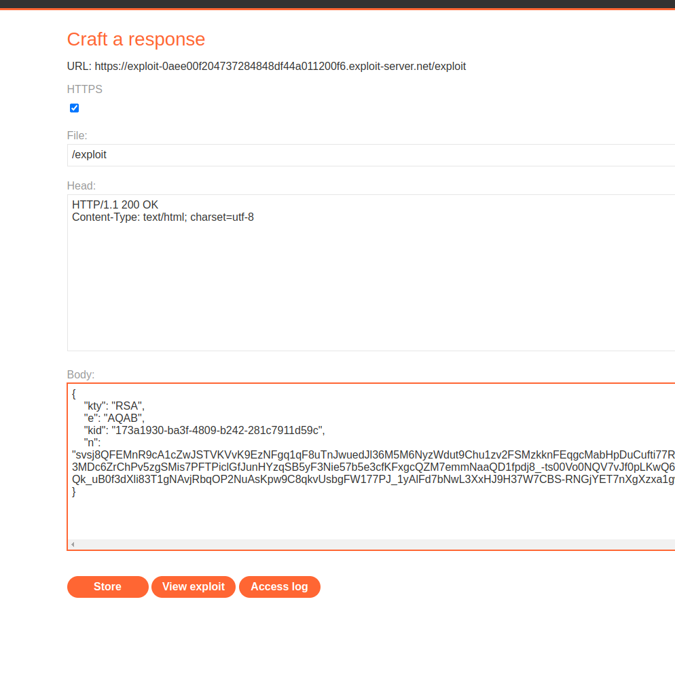
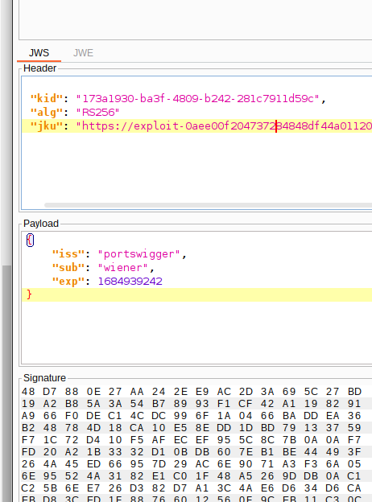
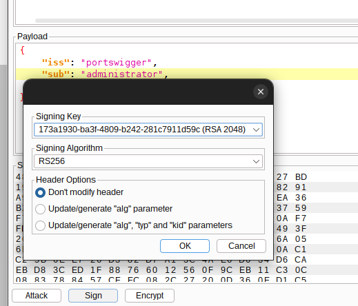
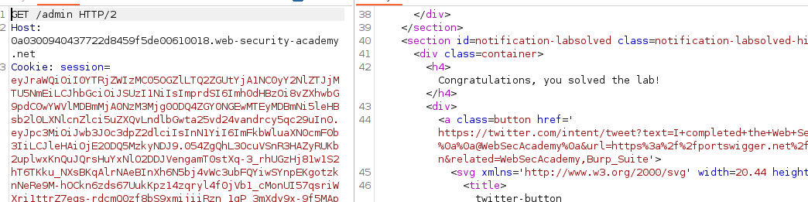

This lab uses a JWT-based mechanism for handling sessions. The server supports the `jku` parameter in the JWT header. However, it fails to check whether the provided URL belongs to a trusted domain before fetching the key.

To solve the lab, forge a JWT that gives you access to the admin panel at `/admin`, then delete the user `carlos`.

You can log in to your own account using the following credentials: `wiener:peter`

* Create new RSA Key

* Copy Key Public Key as JWK
  
  

* Paste at exploit server ( inside your lab URL) 

* Change the kid with the KID generate at previous step

* Set a new jku parameter

* Click attack and sign the JWT

* Change de KID with the KID generated by our previous payload and the JKU with the url of exploit server

* Lab solved

