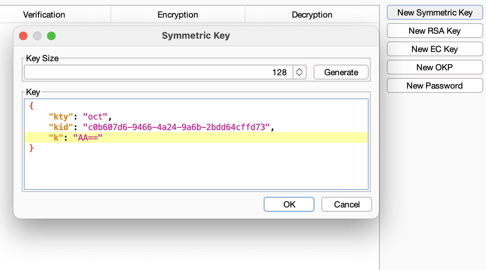
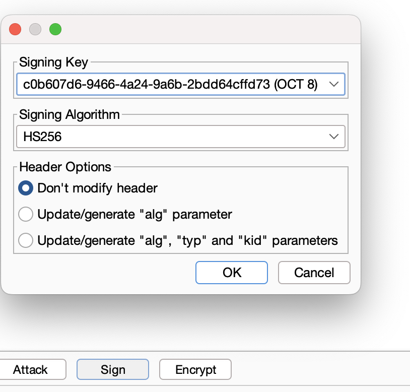
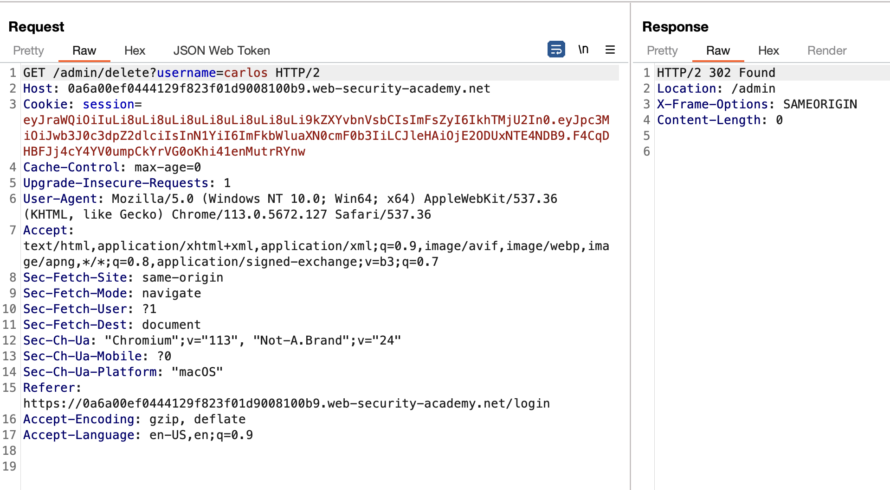

#### Lab description

This lab uses a JWT-based mechanism for handling sessions. In order to verify the signature, the server uses the `kid` parameter in JWT header to fetch the relevant key from its filesystem.

To solve the lab, forge a JWT that gives you access to the admin panel at `/admin`, then delete the user `carlos`.

You can log in to your own account using the following credentials: `wiener:peter`

### Solution

* Generate a `new simetric key`

* Change the `k` value to `AA==` null byte char

>  Note that this is just a workaround because the JWT Editor extension won't allow you to sign tokens using an empty string.

* Change the value of the `kid` to `../../../../../../../dev/null`

* Change the value of `sub` to `administrador`

* Click at `sign` inside the tab of `JSON Web Token Extension` with the key previous generated with de null byte `AA==`

* Send the request and verify that you can access the admin panel.

* Lab solved!

