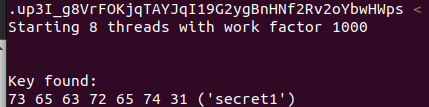

This lab uses a JWT-based mechanism for handling sessions. It uses an extremely weak secret key to both sign and verify tokens. This can be easily brute-forced using a [wordlist of common secrets](https://github.com/wallarm/jwt-secrets/blob/master/jwt.secrets.list).

To solve the lab, first brute-force the website's secret key. Once you've obtained this, use it to sign a modified session token that gives you access to the admin panel at `/admin`, then delete the user `carlos`.

You can log in to your own account using the following credentials: `wiener:peter`

* User token

* Key found

* Tampering the JWT token with the **secret** found with the tool

* Lab solved

* 2º Method

1.  Using Burp Decoder, Base64 encode the secret that you brute-forced in the previous section.
2.  In Burp, go to the **JWT Editor Keys** tab and click **New Symmetric Key**. In the dialog, click **Generate** to generate a new key in JWK format. Note that you don't need to select a key size as this will automatically be updated later.
3.  Replace the generated value for the `k` property with the Base64-encoded secret.
4.  Click **OK** to save the key.
5.  Go back to the `GET /admin` request in Burp Repeater and switch to the extension-generated **JSON Web Token** message editor tab.  
6.  In the payload, change the value of the `sub` claim to `administrator` 
7.  At the bottom of the tab, click `Sign`, then select the key that you generated in the previous section.  
8.  Make sure that the `Don't modify header` option is selected, then click `OK`. The modified token is now signed with the correct signature.  
9.  Send the request and observe that you have successfully accessed the admin panel.  
10.  In the response, find the URL for deleting Carlos (`/admin/delete?username=carlos`). Send the request to this endpoint to solve the lab.

